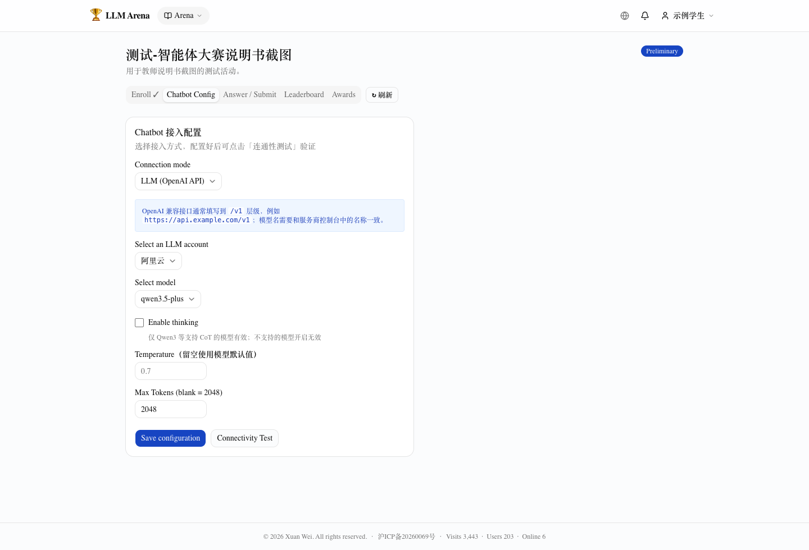
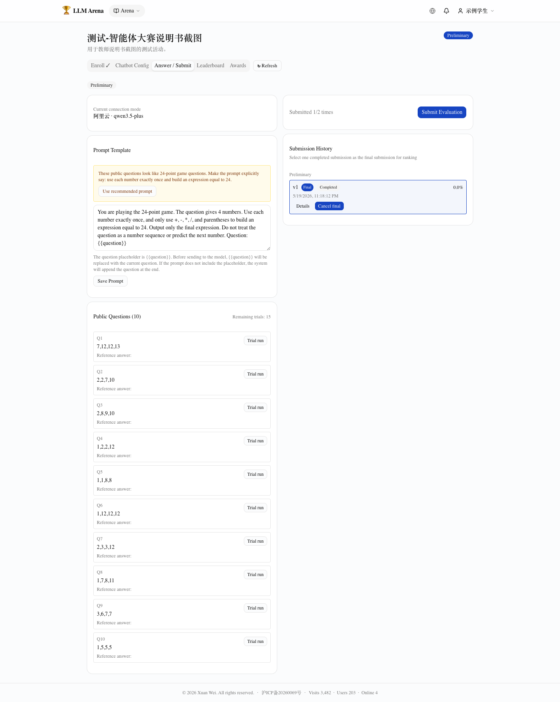

# LLM Agent Contest Guide (Game 24)

This guide explains how to configure a Game 24 agent contest. The instructor defines the questions and judging rules, while students connect their own Chatbot, Dify app, or Coze Bot. It is better suited for evaluating full agent design.

This contest is especially useful after students have learned Dify / Coze or tool-augmented agents. A key lesson is that when an LLM agent can use tools such as Python, accuracy on Game 24 can become much higher than Prompt-only solutions.

## 1. Recommended Settings

| Setting | Recommendation |
|---|---|
| Connection mode | Disable organizer-provided LLM. |
| Student task | Configure OpenAI-compatible API / Dify / Coze. |
| Preliminary submissions | 2 |
| Final submissions | 2 |
| Finalists | For around 70 participants, start with 6-10. |
| Trial runs | 10-15 |
| Question split | Train and test should be similar in size, around 12-15 each. |
| Judge profile | Objective judge returning 0/1. |
| Judge model | `qwen3.5-plus` or a stronger equivalent. |
| Cost reminder | The instructor pays judge-model cost; students may also consume their own platform/model quota. |

## 2. Prepare Question Bank and Judge Profile

The agent contest can reuse the same Game 24 question bank and judge profile as the Prompt contest.

```text
4,10,10,12
```

Use an **OBJECTIVE** judge and require a JSON response such as:

```json
{"score": 0 or 1, "reason": "brief explanation"}
```

## 3. Create the Activity

The key difference from a Prompt contest is: **do not enable organizer-provided LLM**. This allows students to choose their own connection mode.

Keep the activity in Draft while checking title, judge profile, submission limits, question splits, allowed external platforms, output format, and a full student-side test flow.

## 4. Student Connection Modes

Students open “Chatbot Config” and choose one of:

- **LLM (OpenAI API)**: select or fill in an OpenAI-compatible API account, model, and Prompt.
- **Dify Chatbot**: enter Dify endpoint and API key.
- **Coze Chatbot**: enter Coze endpoint, API key, and Bot ID.



Never expose real API keys in public repositories, slides, or screenshots. Use placeholders such as `<YOUR_API_KEY>`.

## 5. Connectivity Test

After saving configuration, students should click “Connectivity Test”. If it fails, check the API base URL, API key, model name, Dify / Coze endpoint, and provider/network availability.

## 6. Answering and Submission

Students use public train questions for trials and submit formal evaluations after the configuration is stable.



Agent contests usually consume more external model calls than Prompt contests. Limit submissions, set reasonable trial-run limits, remind students to control API cost, and ask them to save reproducible configurations.

## 7. Teaching Notes

Agent contests are usually more uncertain than Prompt contests: model capability, external platform reliability, workflow design, and API configuration can all affect results. Use failures to discuss connection stability, output constraints, tool-use effectiveness, reasoning errors, and configuration errors.
