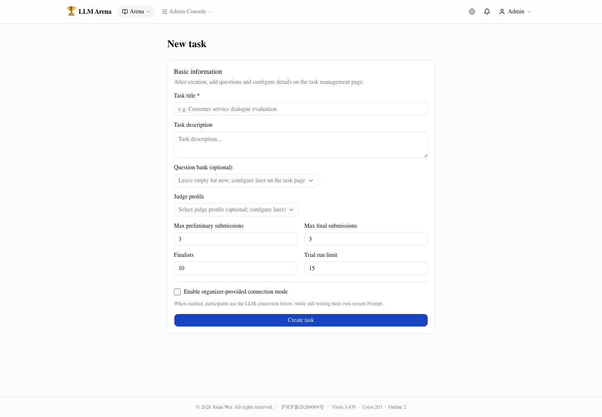
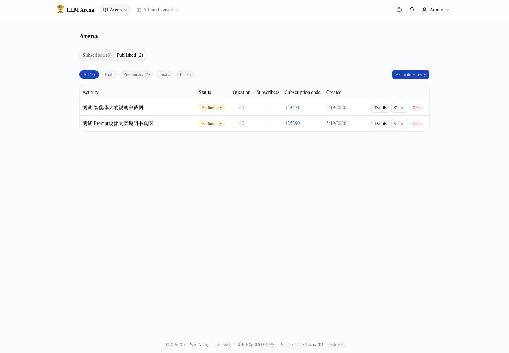
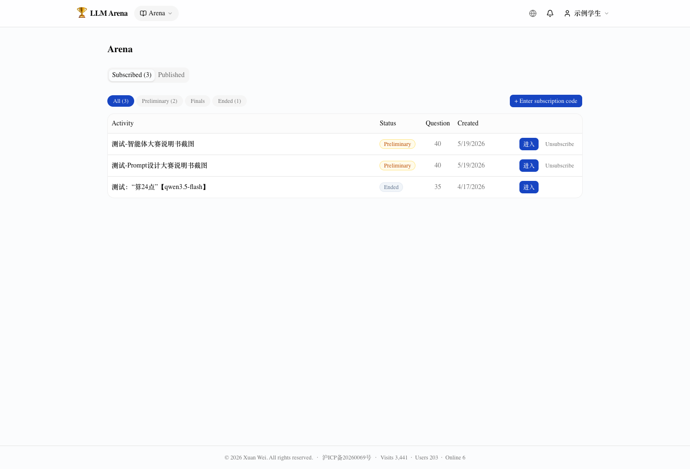

# Arena System Guide

Arena is a Chatbot competition platform for LLM teaching and classroom competitions. Instructors publish activities and configure question banks and judge profiles. Students subscribe to activities, configure a Chatbot or Prompt, and let the system automatically run answers, scoring, leaderboards, and awards.



## 1. Roles and Use Cases

Arena has two major roles:

- **Admin / publisher**: creates activities, manages question banks, judge profiles, activity stages, submissions, leaderboards, and awards.
- **Student / participant**: subscribes to activities, enrolls, configures a Chatbot or Prompt, runs public trials, submits formal evaluations, and views scores and leaderboards.

A typical teaching workflow:

1. The instructor prepares a task, such as Game 24, Q&A, writing, or tool-use tasks.
2. The instructor configures questions, a judge profile, submission limits, and advancement rules.
3. Students join the activity using a subscription code.
4. Students iterate on Prompts or agent configurations and submit evaluations.
5. The system ranks submissions by train/test scores and shows awards after the activity ends.

## 2. Activity Lifecycle

| Stage | Meaning |
|---|---|
| Draft | The instructor prepares the activity. Students cannot subscribe yet. |
| Preliminary | Students can subscribe, enroll, run trials, and submit. |
| Finals | Advanced students continue with final-stage submissions. |
| Ended | Submissions stop; final ranking and awards are shown. |

## 3. Instructor Workspace

After signing in, instructors manage activities from the Arena dashboard and the “Published” tab.



Common actions include creating an activity, cloning a template, opening activity details, copying the subscription code, and filtering activities by stage.

Prepare reusable question banks and judge profiles first, then create activities for different classes or topics. Because Arena currently relies heavily on LLM-based judging, activity design should consider teaching goals, scoring stability, API cost, and classroom time.

Two common formats:

- **Classroom experience**: fewer questions, suitable for in-class activities. Frame the activity as learning and exploration rather than a high-stakes ranking.
- **Competitive ranking**: more questions and stronger hidden test coverage. Rankings become more meaningful, but API cost and evaluation time increase.

## 4. Question Banks and Splits

Each question can be assigned to one of three splits:

- **Train**: visible to students; useful for trials and debugging.
- **Test**: hidden and used for official scoring.
- **Unused**: kept as backup and not evaluated.

For Game 24, a classroom activity can use 10-15 train questions and 10-15 test questions. Larger competitions can use more, but should account for cost and waiting time.

## 5. Chatbot Connection Modes

### 5.1 Prompt Contest

The instructor provides the model account and model; students only write Prompts. This is suitable for comparing Prompt design under the same model.


### 5.2 Agent Contest

Students configure their own Chatbot connection through an OpenAI-compatible API, Dify, or Coze. This format is better for evaluating model choice, system prompts, workflow design, and external agent platforms.


After configuration, students should run a connectivity test before trials and formal submissions.

## 6. Judge Profiles

A judge profile converts student outputs into scores. Arena supports:

- **Objective judge**: returns 0 or 1 for tasks with clear answers.
- **Subjective judge**: returns a score from 0 to 1 for writing, analysis, or open-ended Q&A.

For Game 24, use an objective judge that checks whether the answer uses all four numbers exactly once, uses only arithmetic operators and parentheses, and evaluates to 24.

Example judge prompt:

```text
You are a judge for the Game 24 task. The task gives 4 numbers. A valid answer must use each number exactly once, only use addition, subtraction, multiplication, division, and parentheses, and produce an expression equal to 24.

Question: {{question}}
Reference answer: {{expected}}
Student answer: {{output}}

Check whether the student answer satisfies all requirements:
1. All 4 numbers from the question are used.
2. Each number is used exactly once.
3. Only +, -, *, /, and parentheses are used.
4. The expression evaluates to 24.

Return only a JSON object: {"score": 0 or 1, "reason": "brief explanation"}
```

## 7. Student Workflow

Students open the Arena dashboard, view subscribed activities, or enter a 6-digit subscription code to join a new activity.



A typical workflow is: enroll, configure the Chatbot or Prompt, run a connectivity test, run public trials, submit formal evaluation, and view submission history and leaderboards.


## 8. Leaderboards and Awards

Leaderboards show student scores. After the activity ends, instructors can use the awards page to present final results.

Suggested rules to announce in advance:

- Submission limits for preliminary and final stages.
- Final ranking is based on hidden test scores.
- Trial runs are limited and are not formal submissions.
- How SYSERR or system errors are handled.
- Classroom activities should be treated as learning experiences rather than high-stakes exams.

## 9. Launch Checklist

Before publishing an activity, check that the title is clear, questions include train/test splits, the judge profile passes connectivity testing, the connection mode matches the contest goal, limits are configured, the subscription code is enabled, and a student account can complete the full flow.
